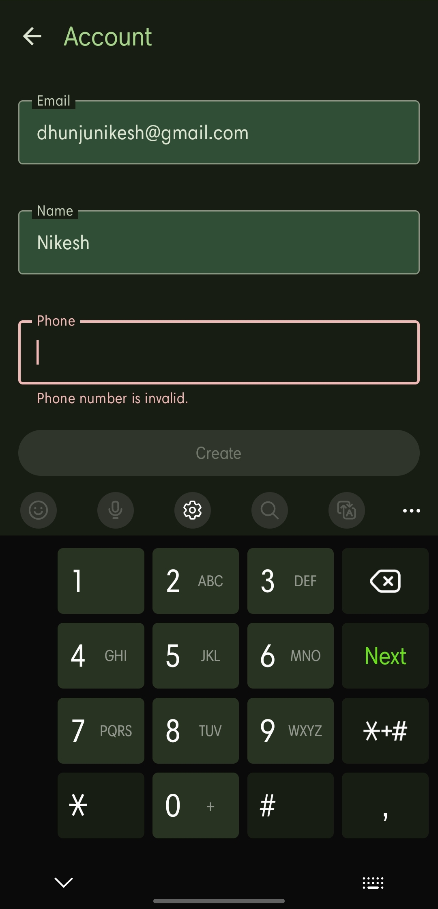

# Relay App

Android app to relay calls and messages from child device to parent device. 
This comes in handy when you are traveling to a different country but want 
to be able to receive calls and messages from your country's number.

This app uses best practices for Android and uses the following libraries:

- **Firestore Database**: For temporarily storing data in cloud
- **Jetpack Compose**: For building modern and declarative UIs.
- **WorkManager**: For syncing server data to local database periodically.
- **Gson**: For serializing and deserializing.
- **Room**: To store persistent data offline
- **Dagger**: For dependency injection.
- **JUnit**: For unit testing.

<table>
  <tr>
    <th colspan="2">Account Page</th>
  </tr>
  <tr>
    <td></td>
  </tr>
<tr>
    <td>
Account Screen that respects dynamic theme set by the user.
</td>
  </tr>
</table>