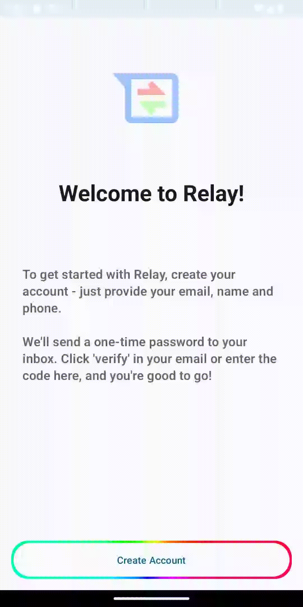
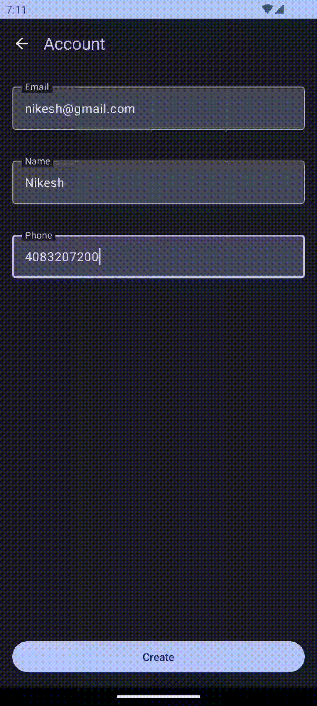

# Relay App

Android app to relay calls and messages from child device to parent device. 
This comes in handy when you are traveling to a different country but want 
to be able to receive calls and messages from your country's number.

This app uses best practices for Android and uses the following libraries:

✅ **Firestore Database**: For temporarily storing data in cloud  
✅ **Firesbase Analytics**: For logging key app events and logs for better debugging 
✅ **Firesbase Messaging**: For sending push notification to the user 
✅ **Jetpack Compose**: For building modern and declarative UIs. 
✅ **WorkManager**: For syncing server data to local database periodically. 
✅ **DateStore**: For storing simple key value persistently on device. 
✅ **Gson**: For serializing and deserializing. 
✅ **Room**: To store persistent data offline 
✅ **Dagger**: For dependency injection. 
✅ **JUnit**: For unit testing. 

### Icons

<table>
  <tr>
    <th>App Icon</th>
    <th>Animated App Icon</th>
  </tr>
  <tr>
    <td align="center"></td>
    <td align="center"></td>
  </tr>
</table>

### Screens
Scroll horizontally to see more ➡️

<table>
  <tr>
    <th>Welcome Screen</th>
    <th>Account Screen</th>
    <th>Side Navigation</th>
    <th>Splash Screen</th>
  </tr>
  <tr>
    <td></td>
    <td></td>
    <td></td>
    <td></td>
  </tr>
  <tr>
    <td width="256">
Welcome Screen with animated button.
</td>
    <td width="256">
Account Screen that respects dynamic theme set by the user and handles error.
</td>
    <td width="256">
Side navigation.
</td>
    <td width="256">
Splash Screen with animated app logo.
</td>
  </tr>
</table>